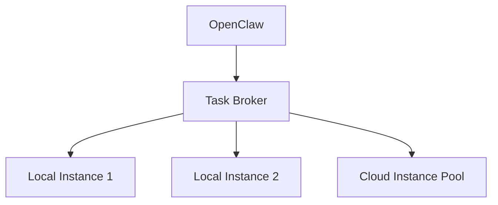

# Phase 3b: Multi-Instance Execution Architecture

## Overview
This document outlines the architecture for scaling Windsurf to multiple concurrent execution instances.

## Implementation Options
1. **Local Scaling**
   - Run multiple Windsurf instances on your Mac
   - Pros: Simple, no cloud costs
   - Cons: Limited by local hardware

2. **Cloud Deployment**
   - AWS/GCP instances with auto-scaling
   - Pros: Virtually unlimited scaling
   - Cons: Higher complexity and cost

3. **Hybrid Approach**
   - Local primary + cloud fallback instances
   - Balanced cost/performance

## Recommended Path

## Next Steps
1. Benchmark single instance capacity
2. Set up monitoring dashboard
3. Implement auto-scaling triggers
