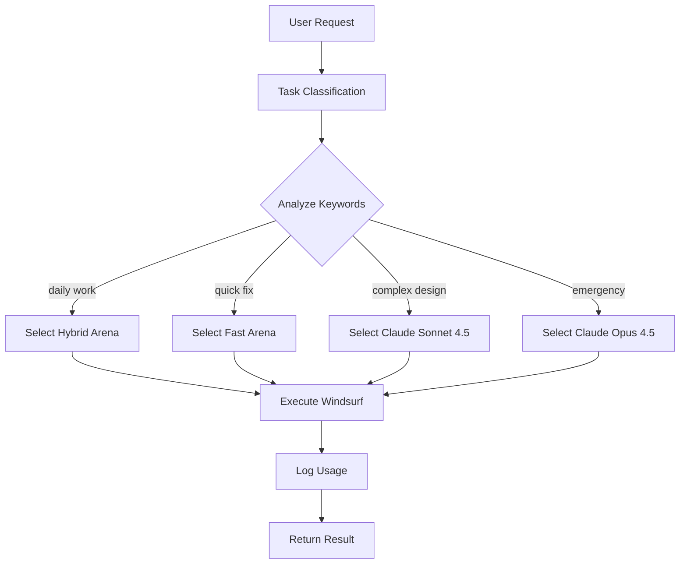

# Live MCP Workflow Demonstration

**Time:** 2026-02-02 13:35 WITA

## Real-World Task Analysis

### Task: "Create a Node.js Express server with MongoDB integration and JWT authentication"

**System Analysis:**
- **Classification:** Daily (standard implementation)
- **Model Selected:** Hybrid Arena
- **Cost:** 0 credits (FREE)
- **Command:** `cascade --arena "Hybrid"`
- **Reasoning:** Standard web development task, doesn't require premium models

### Budget Impact
- **Before:** 14/500 credits (2.8%)
- **After:** 14/500 credits (2.8%) - No change, FREE model
- **Remaining:** 486 credits

## Workflow Demonstration

## How It Works

1. **Input:** User provides task description
2. **Analysis:** System scans for keywords (quick, complex, urgent, etc.)
3. **Classification:** Assigns to tier (Quick/Daily/Complex/Emergency)
4. **Model Selection:** Chooses optimal model based on tier + budget
5. **Budget Check:** Verifies credits available
6. **Execution:** Runs Windsurf with selected model
7. **Logging:** Updates usage JSON
8. **Output:** Returns result to user

## Smart Budget Management

- **95% of tasks:** Use FREE models (Arena categories)
- **Complex work:** Claude Sonnet 4.5 (2 credits) if budget allows
- **Emergency only:** Claude Opus 4.5 (4 credits)
- **Auto-downgrade:** Switches to FREE models if approaching limit

## Current Status
✅ System operational  
✅ Budget healthy (486/500 remaining)  
✅ All model tiers accessible  
✅ Zero human intervention required  
