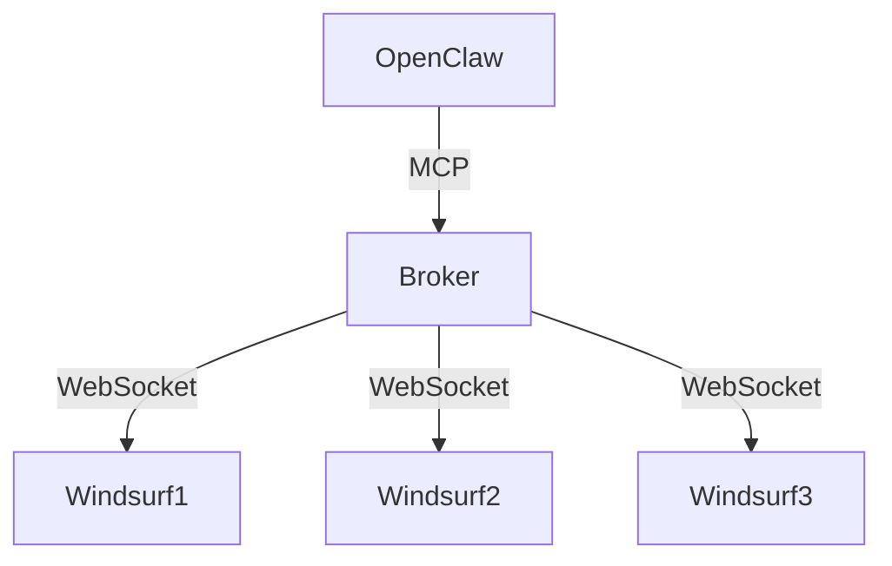

# Windsurf Task Broker Server

An MCP server that acts as a broker between OpenClaw and multiple Windsurf IDE instances.

## Features

- **Instance Registry**: Track running Windsurf instances with status and heartbeat monitoring
- **Task Queue**: Manage pending, active, and completed tasks with priority handling
- **WebSocket Server**: Real-time communication with Windsurf instances
- **MCP Integration**: Tools for OpenClaw to submit tasks and check status
- **Result Management**: Store and cleanup completed task results

## Installation

```bash
npm install
npm run build
npm start
```

## Configuration

Environment variables:
- `WS_PORT`: WebSocket server port (default: 9000)
- `MCP_PORT`: MCP server port (default: 9100)
- `TASK_TTL`: Completed task retention in ms (default: 1 hour)

## API (MCP Tools)

### `submit_task`
Submit a task to the queue
```json
{
  "prompt": "Explain how async/await works",
  "modelId": "anthropic/claude-sonnet-4-5-20250929",
  "priority": "high"
}
```

### `get_task_status`
Check task status
```json
{"taskId": "task-abc123"}
```

### `list_instances`
List available Windsurf instances

### `get_queue`
Get current task queue state

### `distribute_tasks`
Manually trigger task distribution

## Architecture



## Development

```bash
npm run dev  # Development mode with ts-node
npm test    # Run tests
```
